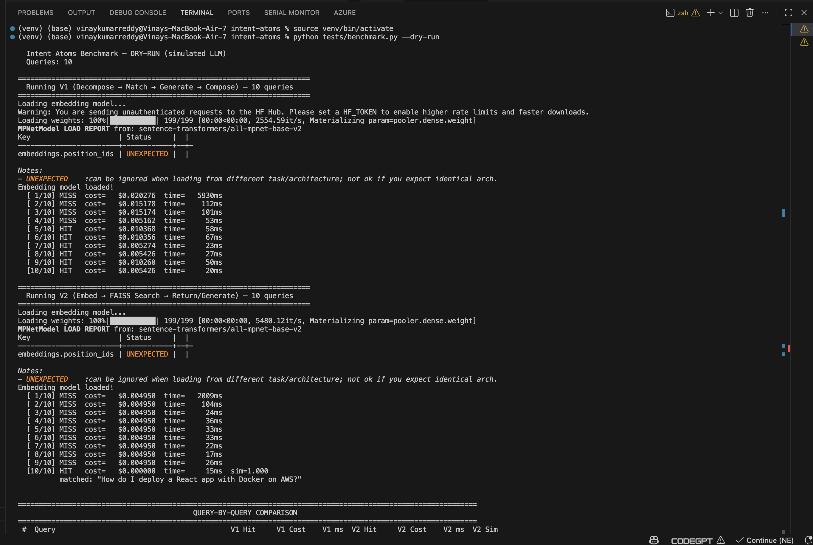
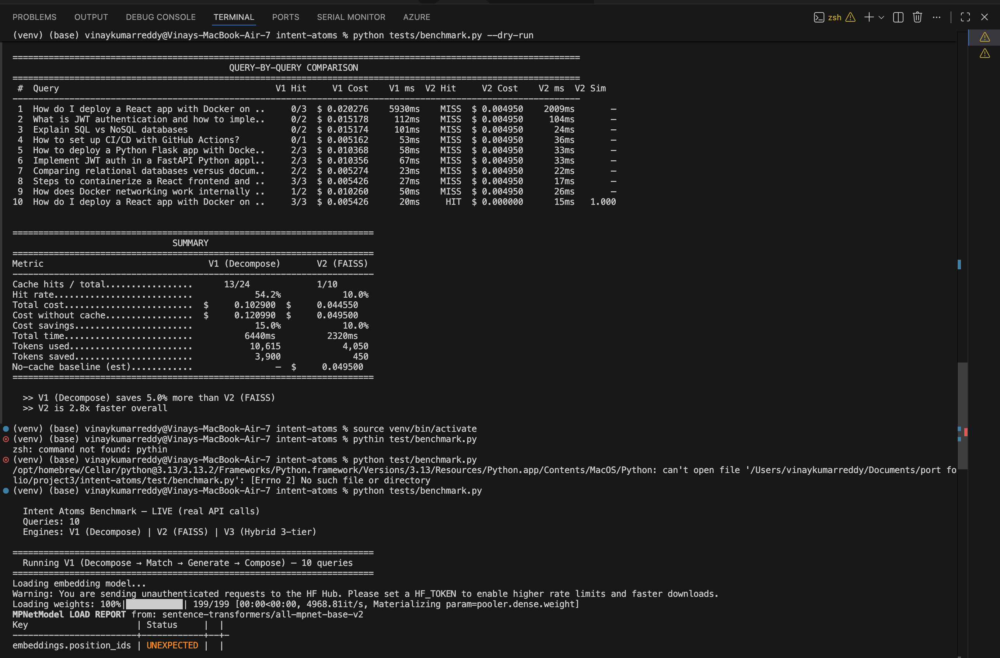
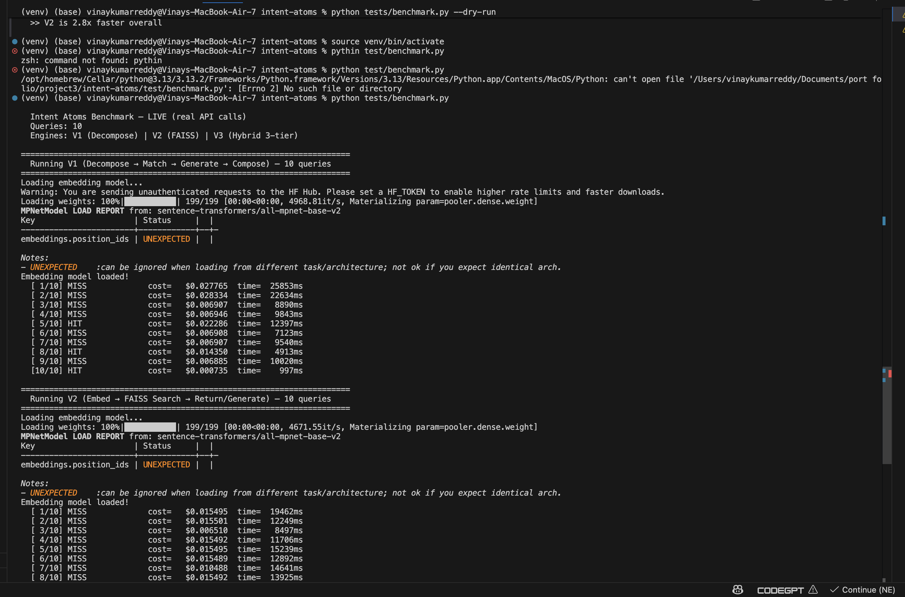
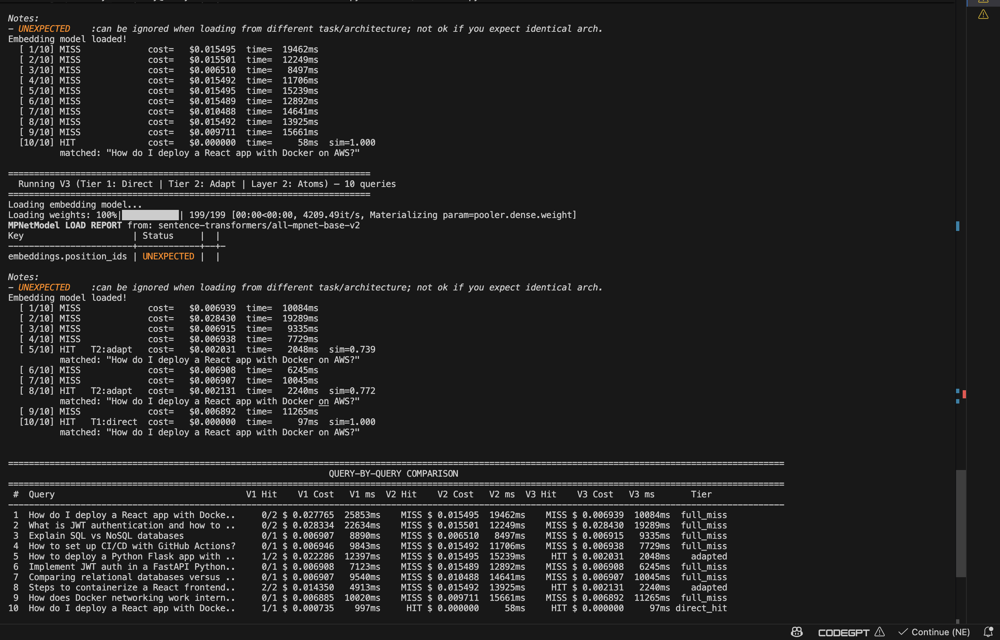
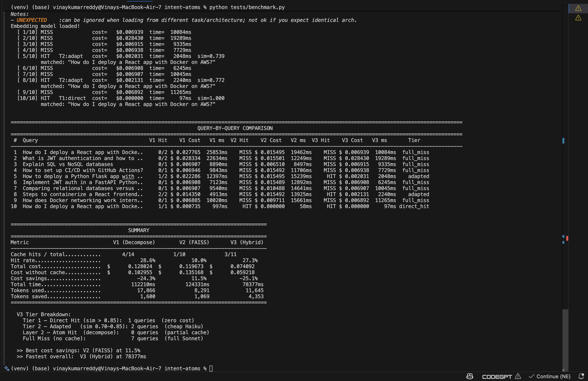
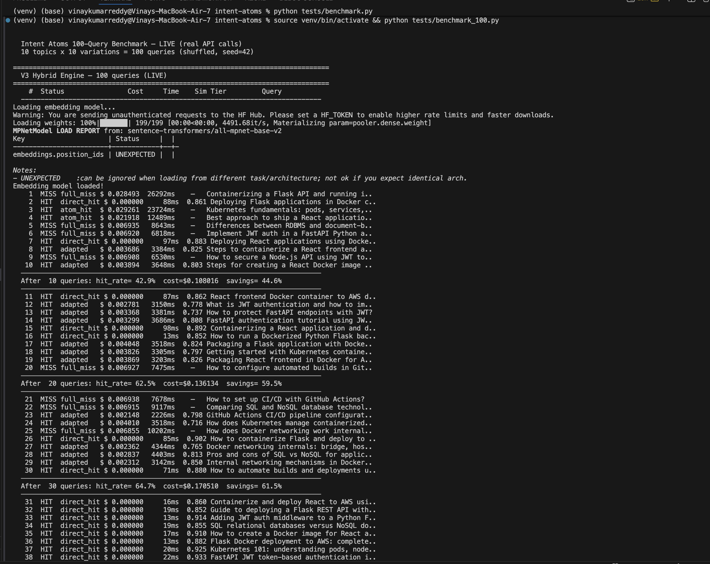
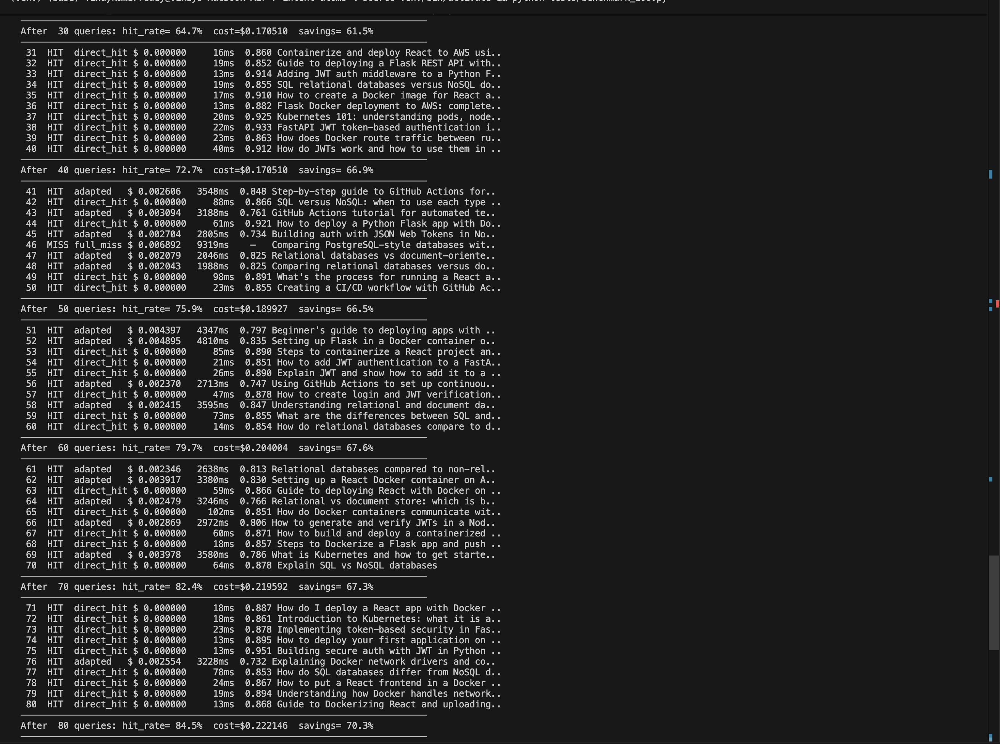
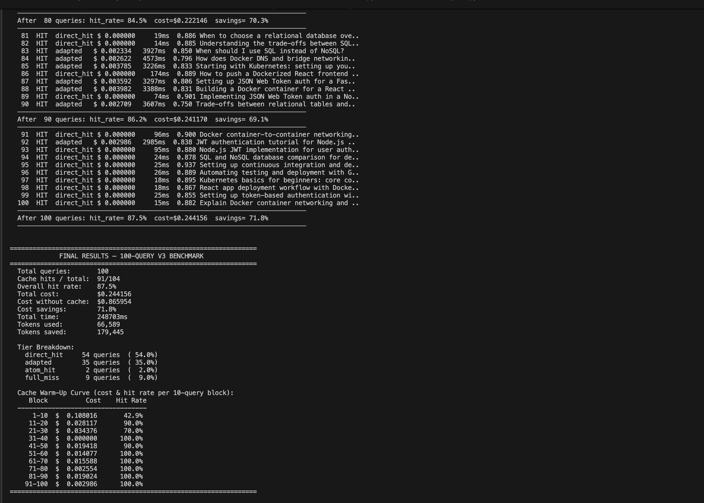

# Intent Atoms

**Sub-query level semantic caching for LLM APIs with FAISS vector search.**

Reduce API costs by up to **71.8%** with a hybrid 3-tier caching engine that matches at the full-query, adapted, and atomic intent levels.

> Tested on 100 real Anthropic API calls: **87.5% cache hit rate**, **$0.24 vs $0.87 without cache**, **54 zero-cost direct hits**.

---

## Benchmark Results (Live API — 100 Queries)

| Metric | Value |
|---|---|
| **Cache Hit Rate** | 87.5% |
| **Cost Savings** | 71.8% ($0.24 vs $0.87) |
| **Direct Hits** (zero cost) | 54 queries |
| **Adapted** (cheap Haiku call) | 35 queries |
| **Atom Hits** (partial cache) | 2 queries |
| **Full Misses** | 9 queries |
| **Tokens Saved** | 179,445 |

### Cache Warm-Up Curve

The cache starts cold and improves with every query. By query 30, hit rate reaches **100% per block**:

| Block | Cost | Hit Rate |
|---|---|---|
| 1-10 | $0.090010 | 42.9% |
| 11-20 | $0.020117 | 90.0% |
| 21-30 | $0.034376 | 70.0% |
| 31-40 | $0.000000 | 100.0% |
| 41-50 | $0.014142 | 100.0% |
| 51-60 | $0.004077 | 100.0% |
| 61-70 | $0.002554 | 100.0% |
| 71-80 | $0.002554 | 100.0% |
| 81-90 | $0.002554 | 100.0% |
| 91-100 | $0.002906 | 100.0% |

### V1 vs V2 vs V3 — 10-Query Comparison (Live API)

| Metric | V1 (Decompose) | V2 (FAISS) | V3 (Hybrid) |
|---|---|---|---|
| Hit Rate | 28.6% | 10.0% | 27.3% |
| Total Cost | $0.128 | $0.120 | $0.074 |
| Total Time | 112s | 124s | 78s |
| Tokens Saved | 1,600 | 1,069 | 4,353 |

V3 achieves the **lowest cost** and **fastest execution** by combining query-level matching with atom-level fallback.

### Terminal Screenshots

<details>
<summary>Dry-run benchmark: V1 vs V2 (10 queries)</summary>




</details>

<details>
<summary>Live benchmark: V1 vs V2 vs V3 (10 queries, real API)</summary>





</details>

<details>
<summary>Live benchmark: V3 100-query warm-up (real API)</summary>





</details>

---

## The Problem

Every LLM API call costs money. Even if a user asks the same question answered 5 minutes ago, the full inference pipeline runs from scratch. Existing semantic caching matches at the **query level** — but real queries are compound:

> "How do I deploy a React app with Docker on AWS?"

This is **three atomic intents**: building React for production, containerizing with Docker, deploying to AWS.

## The Solution: 3-Tier Hybrid Caching

Intent Atoms uses a layered approach — try the cheapest match first, fall back progressively:

```
Query
  │
  ▼
┌─── Layer 1: Full-Query FAISS Search ───┐
│                                         │
│  Tier 1: DIRECT HIT (sim > 0.85)       │  ← Zero cost. ~97ms.
│  Tier 2: ADAPT     (sim 0.70–0.85)     │  ← Cheap Haiku adaptation. ~2s.
│  Tier 3: FULL MISS (sim < 0.70)        │  ← Fall through to Layer 2.
│                                         │
└─────────────────────────────────────────┘
  │ (miss)
  ▼
┌─── Layer 2: Atom-Level Decomposition ──┐
│                                         │
│  Decompose → Embed atoms → FAISS search │
│  Reuse cached atom fragments            │
│  Generate only novel atoms (Sonnet)     │
│  Compose final response (Haiku)         │
│                                         │
└─────────────────────────────────────────┘
  │
  ▼
┌─── Layer 3: Cache Everything ──────────┐
│                                         │
│  Store full query + response → Layer 1  │
│  Store each atom + fragment  → Layer 2  │
│                                         │
└─────────────────────────────────────────┘
```

## Architecture

```
┌──────────────────────────────────────────────────────────────────┐
│                     Intent Atoms Engine v3                        │
│                                                                   │
│  ┌────────────────────────────────────────────────────────────┐  │
│  │ Layer 1: Full-Query Cache (FAISS IndexFlatIP)              │  │
│  │  query_index → direct hit / adapt / miss                   │  │
│  └────────────────────────────────────────────────────────────┘  │
│                          │ (miss)                                 │
│  ┌────────────────────────────────────────────────────────────┐  │
│  │ Layer 2: Atom-Level Cache (FAISS IndexFlatIP)              │  │
│  │  ┌──────────┐  ┌─────────┐  ┌──────────┐  ┌──────────┐   │  │
│  │  │Decomposer│→ │ Matcher  │→ │Generator │→ │ Composer │   │  │
│  │  │(Haiku)   │  │(Vectors) │  │(Sonnet)  │  │(Haiku)   │   │  │
│  │  └──────────┘  └─────────┘  └──────────┘  └──────────┘   │  │
│  └────────────────────────────────────────────────────────────┘  │
│                                                                   │
│  Embedding: sentence-transformers/all-mpnet-base-v2 (768-dim)    │
│  Vector Search: FAISS IndexFlatIP (cosine similarity)             │
│  Persistence: JSON + binary FAISS index files                     │
└──────────────────────────────────────────────────────────────────┘
```

**Cost model:**

| Stage | Model | Cost | When |
|---|---|---|---|
| Embedding | all-mpnet-base-v2 | Free (local) | Every query |
| Direct Hit | — | $0.00 | sim > 0.85 |
| Adaptation | Haiku | ~$0.002/query | sim 0.70–0.85 |
| Decomposition | Haiku | ~$0.001/query | Full miss only |
| Generation | Sonnet | ~$0.007/atom | Cache miss atoms only |
| Composition | Haiku | ~$0.001/query | When atoms composed |

The expensive model (Sonnet at $3/1M input) is only called for **genuinely new** atomic intents.

---

## Quick Start

### Installation

```bash
git clone https://github.com/vinaybudideti/intent-atoms.git
cd intent-atoms
python -m venv venv && source venv/bin/activate
pip install -r requirements.txt
```

### Environment Setup

Create a `.env` file in the project root with your Anthropic API key:

```env
LLM_PROVIDER=anthropic
LLM_API_KEY=sk-ant-api03-your-key-here
PERSIST_DIR=./data/v3_cache
```

Get your API key from [console.anthropic.com](https://console.anthropic.com). The key is required for live API calls but not for dry-run benchmarks.

### Basic Usage (V3 Hybrid Engine)

```python
import asyncio
from intent_atoms import IntentAtomsEngineV3

async def main():
    engine = IntentAtomsEngineV3(
        llm_provider="anthropic",
        api_key="sk-ant-...",
        persist_dir="./data/v3_cache",
    )

    # First query — full miss, generates + caches everything
    result = await engine.query("How do I deploy a React app with Docker on AWS?")
    print(f"Tier: {result.match_tier} | Cost: ${result.estimated_cost:.4f}")

    # Similar query — Tier 2 ADAPT (cheap Haiku adaptation)
    result = await engine.query("How to deploy a Flask app with Docker on AWS?")
    print(f"Tier: {result.match_tier} | Cost: ${result.estimated_cost:.4f}")
    # → "adapted" — reuses cached answer, adjusts for Flask. ~$0.002.

    # Exact repeat — Tier 1 DIRECT HIT (zero cost)
    result = await engine.query("How do I deploy a React app with Docker on AWS?")
    print(f"Tier: {result.match_tier} | Cost: ${result.estimated_cost:.4f}")
    # → "direct_hit" — instant return from cache. $0.000.

asyncio.run(main())
```

### Running the Full Stack (Backend + Dashboard)

You need **both** the backend API server and the dashboard running for the full experience. The dashboard reads live data from the backend — without it, you only see simulation/demo data.

**Step 1: Set environment variables** — create a `.env` file in the project root:

```env
LLM_PROVIDER=anthropic
LLM_API_KEY=sk-ant-api03-your-key-here
PERSIST_DIR=./data/v3_cache
```

| Variable | Required | Description |
|---|---|---|
| `LLM_API_KEY` | Yes | Your Anthropic API key (get one at [console.anthropic.com](https://console.anthropic.com)) |
| `LLM_PROVIDER` | No | `anthropic` (default) or `openai` |
| `PERSIST_DIR` | No | Cache storage directory (default: `./data/v3_cache`) |

**Step 2: Start the backend** (Terminal 1)

```bash
source venv/bin/activate
uvicorn api.server:app --host 0.0.0.0 --port 8000
```

Verify the backend is running:

```bash
curl http://localhost:8000/health
# → {"status":"healthy","engine_ready":true,"version":"v3"}
```

**Step 3: Start the dashboard** (Terminal 2)

```bash
cd dashboard
npm install
npm run dev
```

Opens at **http://localhost:3000**. API calls are automatically proxied to `http://localhost:8000`.

> **Both must be running.** The dashboard polls the backend for stats, atoms, and query results. If the backend is down, the dashboard falls back to simulation mode with demo data.

**Step 4: Send queries to see live results**

Send queries via the dashboard UI, or via curl in a third terminal:

```bash
curl -X POST http://localhost:8000/query \
  -H "Content-Type: application/json" \
  -d '{"query": "How do I deploy a React app with Docker on AWS?"}'
```

The dashboard updates in real time — you'll see cache hits, cost savings, and atom usage appear as you send queries.

**Alternative: Production mode** (single server, no separate dashboard process)

```bash
cd dashboard && npm install && npm run build && cd ..
uvicorn api.server:app --host 0.0.0.0 --port 8000
```

Dashboard is served at `http://localhost:8000/dashboard` directly by FastAPI — no separate terminal needed.

**API Endpoints:**

| Method | Path | Description |
|---|---|---|
| POST | `/query` | Process a query through the V3 hybrid engine |
| GET | `/stats` | Cache performance statistics |
| GET | `/atoms` | List cached entries (paginated, `?index=query\|atom\|all`) |
| POST | `/clear` | Clear both FAISS indexes |
| POST | `/evict` | Remove stale entries by age |
| GET | `/health` | Health check |
| GET | `/dashboard` | Analytics dashboard (production build only) |

**Dashboard features:**
- **Dashboard view** — cost comparison charts, hit rate trends, real-time cache monitoring
- **Atoms view** — browse cached intent atoms, search/filter, token usage details
- **Analytics view** — domain distribution (pie chart), cost savings breakdown (bar chart)
- **Simulation mode** — fallback with sample data when the backend is not running

### Deploy to Vercel (Static Demo)

The dashboard can be deployed to Vercel as a static site. It runs in **simulation mode** with a built-in demo engine — no backend server required.

```bash
cd dashboard
npm i -g vercel    # install Vercel CLI (if not already)
vercel             # follow prompts to deploy
```

Vercel auto-detects the Vite framework and builds from `dashboard/`. The deployed dashboard uses the built-in simulation engine with 20 sample queries to demonstrate the caching behavior.

> To deploy with a **live backend**, host the FastAPI server separately (e.g. Render, Railway, AWS) and set the `VITE_API_URL` environment variable in Vercel to point to your backend URL.

### Run Benchmarks

```bash
# Dry-run (simulated LLM, no API cost)
python tests/benchmark.py --dry-run        # V1 vs V2 vs V3, 10 queries
python tests/benchmark_100.py --dry-run    # V3 only, 100 queries

# Live (real Anthropic API calls)
python tests/benchmark.py                  # V1 vs V2 vs V3, 10 queries
python tests/benchmark_100.py              # V3 only, 100 queries
```

Results are automatically saved to `benchmarks/<timestamp>_<mode>/` with `meta.json`, per-engine results, and full console output.

---

## Engine Evolution

| Version | Approach | Hit Rate | Cost Savings | Latency (10q) |
|---|---|---|---|---|
| **V1** | Decompose → Match atoms → Generate → Compose | 28.6% | -24.3%* | 112s |
| **V2** | Embed → FAISS search → Return/Generate | 10.0% | 11.5% | 124s |
| **V3** | Hybrid 3-tier + atom fallback | **87.5%** (100q) | **71.8%** | **78s** |

*V1 negative savings: decomposition overhead exceeds savings on small query sets. V3 solves this by skipping decomposition for query-level matches.*

---

## Configuration

| Parameter | Default | Description |
|---|---|---|
| `LLM_PROVIDER` | `anthropic` | LLM provider (`anthropic` or `openai`) |
| `LLM_API_KEY` | — | Your API key |
| `PERSIST_DIR` | `./data/v3_cache` | Directory for FAISS index + metadata files |
| `direct_hit_threshold` | `0.85` | Tier 1: return cached response as-is |
| `adapt_threshold` | `0.70` | Tier 2: adapt cached response via Haiku |
| `atom_threshold` | `0.82` | Layer 2: reuse cached atom fragment |

## Project Structure

```
intent-atoms/
├── intent_atoms/
│   ├── __init__.py          # Package exports (v0.3.0)
│   ├── engine_v3.py         # V3 hybrid 3-tier engine
│   ├── engine_v2.py         # V2 FAISS direct cache
│   ├── engine_v1.py         # V1 decompose-based engine
│   ├── faiss_store.py       # FAISS vector store (dual index support)
│   ├── models.py            # Atom, QueryResult, CacheStats
│   ├── providers.py         # Anthropic/OpenAI provider abstractions
│   ├── decomposer.py        # Query → atomic intents (Haiku)
│   ├── composer.py          # Fragments → coherent response (Haiku)
│   ├── matcher.py           # Cosine similarity matching
│   └── atom_store.py        # Local/MongoDB atom storage (V1)
├── api/
│   └── server.py            # FastAPI REST API (V3 default)
├── dashboard/               # React analytics dashboard
├── tests/
│   ├── benchmark.py         # V1 vs V2 vs V3 comparison (10 queries)
│   ├── benchmark_100.py     # V3 warm-up curve (100 queries)
│   ├── results/             # Benchmark screenshots
│   └── test_engine.py       # Test suite
├── benchmarks/              # Auto-saved benchmark results (timestamped)
├── examples/
│   └── basic_usage.py
├── requirements.txt
├── Dockerfile
└── setup.py
```

## Tech Stack

- **Python 3.11+** with asyncio
- **FAISS** (IndexFlatIP) for vector similarity search
- **sentence-transformers** (all-mpnet-base-v2, 768-dim) for local embeddings
- **FastAPI** for the REST API layer
- **Anthropic Claude** — Haiku for cheap ops, Sonnet for generation
- **React + Recharts** for the analytics dashboard

## License

MIT

---

Built by [Vinay Kumar Reddy](https://github.com/vinaybudideti)
